# 实时游戏网络协议深度对比：KCP vs WebRTC vs WebSocket

> 本文基于 [kratos-transport](https://github.com/tx7do/kratos-transport) 项目的实际架构，深入分析三种主流实时通信协议在游戏场景下的性能差异与选型策略。

## 1. 三种协议的协议栈全景

### 1.1 KCP

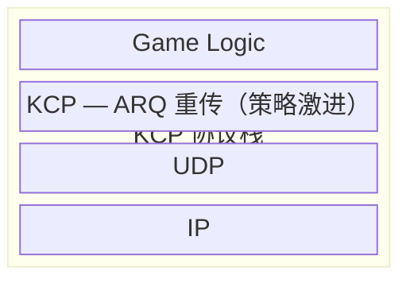

KCP 是一个基于 UDP 的可靠传输协议，由 skywind3000 开发。其核心思想是**用带宽换延迟**——通过更激进的重传策略和拥塞控制，在弱网环境下获得远低于 TCP 的延迟。

关键特性：
- **纯算法层**：不负责底层收发，只处理 ARQ（自动重传请求）逻辑
- **双模式**：支持可靠模式（ARQ）和不可靠模式（纯 UDP）
- **极低开销**：Header 仅 24 字节
- **可调参数**：nodelay、interval、resend、nc 等参数可精细调节

### 1.2 WebRTC DataChannel

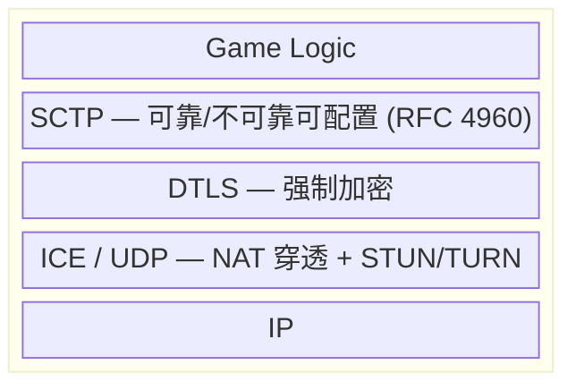

WebRTC 是 W3C 和 IETF 制定的实时通信标准。DataChannel 基于 SCTP over DTLS over UDP，在浏览器中原生支持。

关键特性：
- **双模式**：可靠模式（SCTP 重传）和不可靠模式（`maxRetransmits: 0`）
- **强制加密**：DTLS 层加密，无法关闭
- **P2P 直连**：ICE 协商自动选择最优路径
- **NAT 穿透**：内置 STUN/TURN 支持
- **浏览器原生支持**：所有现代浏览器无需插件

### 1.3 WebSocket

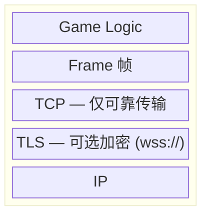

WebSocket 基于 HTTP 升级握手建立 TCP 长连接，是最简单的全双工通信方案。

关键特性：
- **仅可靠模式**：基于 TCP，无不可靠发送能力
- **队头阻塞**：TCP 的根本缺陷——一个包丢失，后续所有包排队等待
- **最广兼容**：所有浏览器、所有网络环境
- **最简部署**：HTTP 端口复用，无需额外基础设施

## 2. 核心机制深度对比

### 2.1 可靠性机制

| 机制       | KCP                   | WebRTC (SCTP) | WebSocket (TCP) |
|----------|-----------------------|---------------|-----------------|
| 重传触发     | 快速重传 + 超时重传           | 快速重传 + 超时重传   | 超时重传            |
| 首次重传等待   | 2 × RTT（可配置为 1 × RTT） | 约 3 × RTT     | 依赖操作系统 TCP 栈    |
| 拥塞控制     | 可关闭（纯全力发送）            | CMT（并发多路径）    | Cubic / BBR     |
| 丢包恢复速度   | ⭐⭐⭐ 快（激进）             | ⭐⭐ 中等         | ⭐ 慢（保守）         |
| 可靠/不可靠切换 | ✅ 同一连接                | ✅ 同一连接        | ❌ 全部可靠          |

### 2.2 为什么 TCP/WebSocket 不适合实时游戏

TCP 的核心问题是**队头阻塞（Head-of-Line Blocking）**：

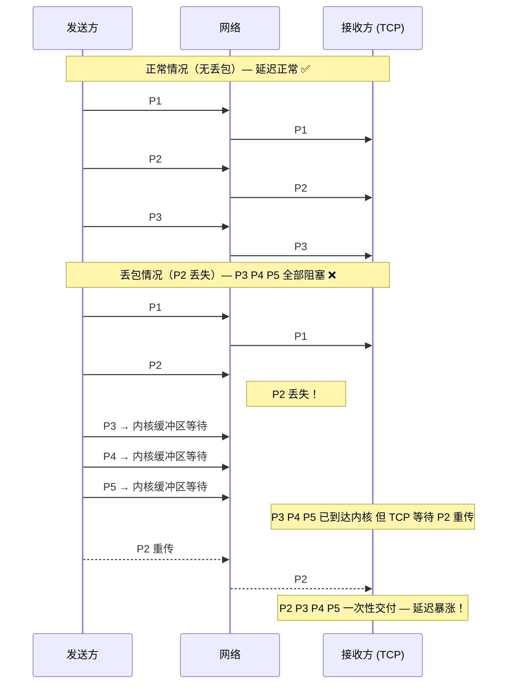

> 在游戏中，P3 P4 P5 是更新的位置数据，P2 已经过时了，等它毫无意义——我们需要的是"最新的"，不是"全部的"。

KCP 和 WebRTC DataChannel 的不可靠模式解决了这个问题：

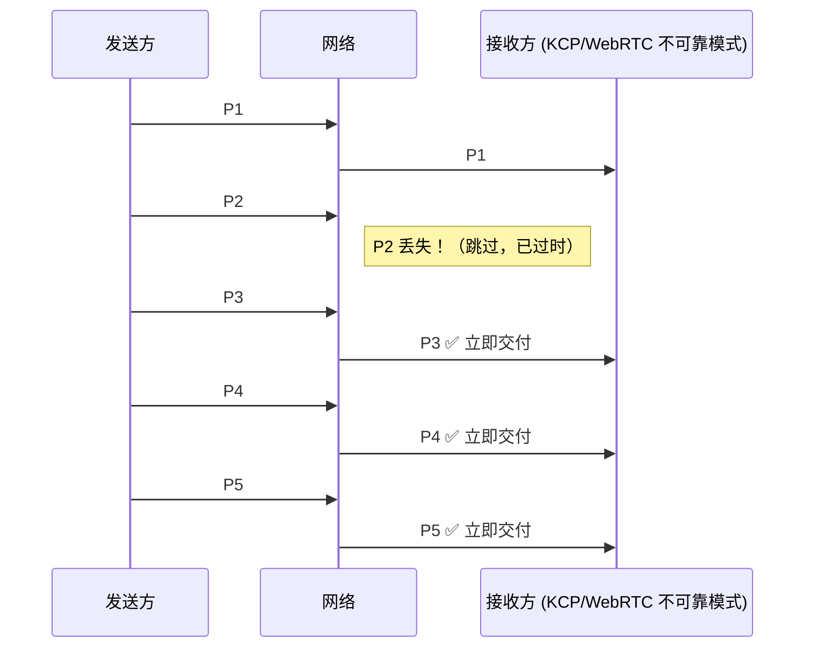

### 2.3 Header 开销对比

| 协议        | Header 大小 | 说明                                                                   |
|-----------|-----------|----------------------------------------------------------------------|
| KCP       | 24 字节     | conv(4) + cmd(1) + frg(1) + wnd(2) + ts(4) + sn(4) + una(4) + len(4) |
| SCTP      | 16 字节     | src/dst port(4) + vtag(4) + checksum(4) + chunk header               |
| DTLS      | 13 字节     | content type(1) + version(2) + epoch(2) + seq(6) + len(2)            |
| WebRTC 总计 | 29+ 字节    | SCTP(16) + DTLS(13)                                                  |
| WebSocket | 2-6 字节    | FIN(1bit) + opcode(4bit) + mask(1bit) + len(7/16/64bit)              |
| TCP       | 20 字节     | 标准TCP头                                                               |
| UDP       | 8 字节      | 标准UDP头                                                               |

**实际效率**（假设有效载荷 100 字节）：

| 协议                 | 总传输     | 有效率   |
|--------------------|---------|-------|
| KCP over UDP       | 132 字节  | 75.8% |
| WebRTC DC          | 137+ 字节 | 73.0% |
| WebSocket over TCP | 126 字节  | 79.4% |

WebRTC 的有效率最低，但对于游戏场景（帧率 30-120fps，每帧几百字节），额外开销在整体带宽中占比极小。

### 2.4 延迟模型

**理想网络（0% 丢包，局域网）**：

| 协议        | 单程延迟   |
|-----------|--------|
| KCP       | 1-3ms  |
| WebRTC    | 5-10ms |
| WebSocket | 1-3ms  |

**公网正常（0.5% 丢包，同城）**：

| 协议        | 单程延迟    |
|-----------|---------|
| KCP       | 10-30ms |
| WebRTC    | 20-50ms |
| WebSocket | 30-60ms |

**弱网（5% 丢包）**：

| 协议        | 单程延迟      | 原因              |
|-----------|-----------|-----------------|
| KCP       | 30-60ms   | 激进重传 + 可选冗余包    |
| WebRTC    | 50-100ms  | SCTP 温和拥塞控制     |
| WebSocket | 200-500ms | TCP 指数退避 + 队头阻塞 |

**恶劣网络（10% 丢包）**：

| 协议        | 单程延迟      | 状态    |
|-----------|-----------|-------|
| KCP       | 60-100ms  | 可玩    |
| WebRTC    | 100-200ms | 勉强可玩  |
| WebSocket | 500ms-2s  | 完全不可玩 |

## 3. 游戏类型 vs 协议选型

### 3.1 延迟敏感度光谱

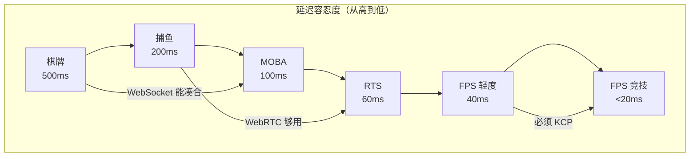

### 3.2 详细场景分析

#### 场景 A：捕鱼 / 休闲游戏

**网络特征**：低频操作（点击发射），高频广播（鱼群位置），容忍偶尔卡顿

| 操作   | 频率       | 可靠性要求 | 延迟容忍  |
|------|----------|-------|-------|
| 发射子弹 | 玩家触发     | 可靠    | 200ms |
| 鱼群同步 | 10-20fps | 不可靠   | 100ms |
| 命中判定 | 玩家触发     | 可靠    | 200ms |
| 金币变化 | 偶发       | 可靠    | 500ms |

**推荐**：**WebRTC DataChannel** — 支持不可靠模式广播鱼群位置，弱网表现远优于 WebSocket

#### 场景 B：MOBA（LOL / Dota2 / 王者荣耀）

**网络特征**：客户端预测 + 服务端权威，30 tick/s，10 人同屏团战

| 操作    | 频率          | 可靠性要求      | 延迟容忍  |
|-------|-------------|------------|-------|
| 英雄移动  | 持续（点击/摇杆）   | 不可靠（服务端纠正） | 60ms  |
| 技能释放  | 玩家触发        | 可靠         | 50ms  |
| 位置同步  | 30fps 服务器广播 | 不可靠        | 60ms  |
| 血量/状态 | 状态变化时       | 可靠         | 100ms |

**推荐**：**WebRTC DataChannel** — LOL 官方在 60ms 延迟下就属于"良好"，WebRTC 完全满足

#### 场景 C：竞技 FPS（CS2 / Valorant / APEX）

**网络特征**：服务端 60-128 tick/s，客户端预测 + 回滚，开镜/压枪/甩枪精度要求极高

| 操作    | 频率        | 可靠性要求    | 延迟容忍  |
|-------|-----------|----------|-------|
| 射击    | 玩家触发      | 可靠（命中校验） | <20ms |
| 移动同步  | 60-128fps | 不可靠      | <15ms |
| 弹道同步  | 每帧        | 不可靠      | <15ms |
| 购买/换弹 | 偶发        | 可靠       | 100ms |

**推荐**：**必须 KCP** — WebRTC 的额外 10-20ms 延迟在 128 tick 下会产生 1-2 tick 的偏差，竞技场景不可接受

#### 场景 D：格斗游戏（街霸 / 铁拳）

**网络特征**：60fps，1帧输入延迟 = 16.6ms，需要帧级回滚

| 操作   | 延迟容忍           |
|------|----------------|
| 输入同步 | **< 16ms（1帧）** |
| 状态回滚 | **< 32ms（2帧）** |

**推荐**：**必须 KCP** — 格斗游戏是最苛刻的场景，1 帧差距就是生死之别

### 3.3 决策矩阵

| 游戏类型          | 推荐方案         | WebRTC 可否 | 原因                |
|---------------|--------------|-----------|-------------------|
| 回合制 / 棋牌      | WebSocket    | ✅ 备选      | 完全不敏感             |
| 捕鱼 / 休闲       | **WebRTC**   | ✅ 首选      | 不可靠模式广播，弱网表现好     |
| MOBA（LOL 级）   | **WebRTC**   | ✅ 可行      | tick 低 + 客户端预测兜底  |
| RTS（星际级）      | WebRTC / KCP | ⚠️ 勉强     | 大量单位同步，弱网敏感       |
| 大逃杀（PUBG 级）   | WebRTC / KCP | ⚠️ 勉强     | 比竞技 FPS 稍宽容       |
| 竞技 FPS（CS2 级） | **KCP**      | ❌         | 20ms 差距决定胜负       |
| 格斗（街霸级）       | **KCP**      | ❌         | 1 帧 (16ms) 就是天壤之别 |

## 4. 基于 kratos-transport 的实战架构

### 4.1 架构总览

[kratos-transport](https://github.com/tx7do/kratos-transport) 项目已经提供了 KCP、WebRTC、WebSocket 三种传输模块，它们共享相同的消息处理架构：

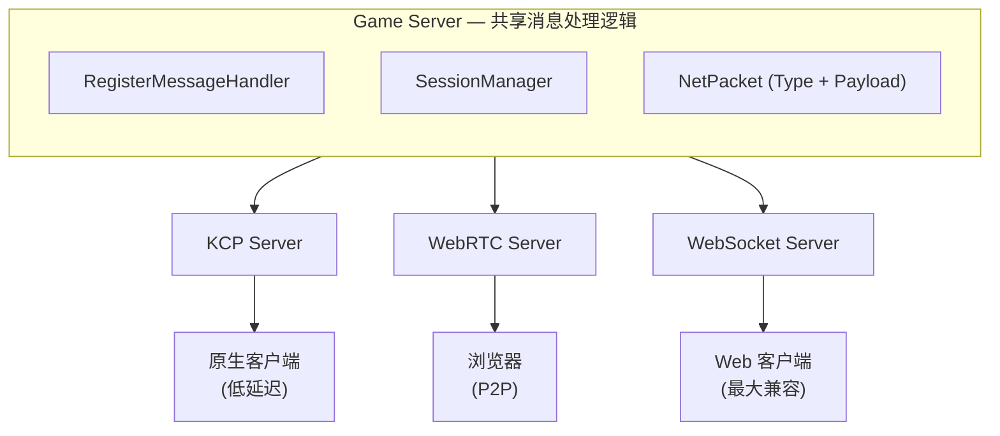

### 4.2 统一消息协议

三种传输模块使用相同的消息封装格式：

```go
// 网络消息包 — 所有传输模块通用
type NetPacket struct {
    Type    NetMessageType // 消息类型（uint32）
    Payload []byte         // 编码后的载荷
}
```

**消息类型注册**（以射击游戏为例）：

```go
const (
    MsgPlayerMove   NetMessageType = 1  // 玩家移动（不可靠）
    MsgPlayerShoot  NetMessageType = 2  // 射击（可靠）
    MsgEntitySync   NetMessageType = 3  // 实体同步（不可靠）
    MsgChat         NetMessageType = 10 // 聊天（可靠）
    MsgStateChange  NetMessageType = 11 // 状态变化（可靠）
)
```

### 4.3 KCP 服务端

```go
package main

import (
    kcpTransport "github.com/tx7do/kratos-transport/transport/kcp"
)

func main() {
    srv := kcpTransport.NewServer(
        kcpTransport.WithAddress(":8080"),
        // KCP 加密
        kcpTransport.WithBlockCrypt("password", "salt"),
        // FEC 纠错（前向纠错，可选）
        kcpTransport.WithFEC(10, 3), // 10 数据片 + 3 校验片
    )

    // 注册消息处理器
    kcpTransport.RegisterServerMessageHandler[PlayerMoveMsg](
        srv, MsgPlayerMove, handlePlayerMove,
    )
    kcpTransport.RegisterServerMessageHandler[ShootMsg](
        srv, MsgPlayerShoot, handleShoot,
    )

    srv.Start(context.Background())
}
```

**关键优势**：
- FEC 前向纠错 — 丢包不需要重传，直接恢复
- 加密传输 — BlockCrypt 基于 AES/TEA/XOR
- 可调窗口 — `kcp.NoDelay(1, 10, 2, 1)` 极速模式

### 4.4 WebRTC 服务端

```go
package main

import (
    webrtcTransport "github.com/tx7do/kratos-transport/transport/webrtc"
)

func main() {
    srv := webrtcTransport.NewServer(
        webrtcTransport.WithAddress(":8080"),
        webrtcTransport.WithSignalPath("/signal"),
        // ICE 服务器配置
        webrtcTransport.WithICEServers([]webrtc.ICEServer{
            {URLs: []string{"stun:stun.l.google.com:19302"}},
        }),
        // 数据通道配置
        webrtcTransport.WithDataChannelLabel("game"),
    )

    // 注册消息处理器（与 KCP 完全一致）
    webrtcTransport.RegisterServerMessageHandler[PlayerMoveMsg](
        srv, MsgPlayerMove, handlePlayerMove,
    )
    webrtcTransport.RegisterServerMessageHandler[ShootMsg](
        srv, MsgPlayerShoot, handleShoot,
    )

    srv.Start(context.Background())
}
```

**浏览器端连接**：

```javascript
const pc = new RTCPeerConnection({
    iceServers: [{ urls: 'stun:stun.l.google.com:19302' }]
});

// 创建不可靠数据通道（用于位置同步）
const unreliableChannel = pc.createDataChannel('game', {
    ordered: false,
    maxRetransmits: 0   // 不可靠模式！
});

// 或创建可靠数据通道（用于命中判定）
const reliableChannel = pc.createDataChannel('game-reliable', {
    ordered: true,
    maxRetransmits: null // 可靠模式（默认）
});

unreliableChannel.onmessage = (event) => {
    const data = new Uint8Array(event.data);
    // 解析 NetPacket，与 Go 端格式一致
    const msgType = new DataView(data.buffer).getUint32(0, true);
    const payload = data.slice(4);
    handleGameMessage(msgType, payload);
};

// 信令流程
const offer = await pc.createOffer();
await pc.setLocalDescription(offer);

const response = await fetch('/signal', {
    method: 'POST',
    body: JSON.stringify({ offer: pc.localDescription })
});

const { answer } = await response.json();
await pc.setRemoteDescription(answer);
```

### 4.5 业务逻辑复用

三种传输方式共享完全相同的处理函数：

```go
// 这个函数同时服务于 KCP 和 WebRTC 的 Server
func handlePlayerMove(sessionId SessionID, msg *PlayerMoveMsg) error {
    // 1. 服务端权威：验证移动合法性
    if !validateMove(msg) {
        return nil
    }

    // 2. 更新游戏状态
    player.UpdatePosition(msg.X, msg.Y, msg.Z)

    // 3. 广播给其他玩家（使用不可靠发送）
    // KCP Server 和 WebRTC Server 都有 Broadcast 方法
    srv.Broadcast(MsgEntitySync, &EntitySyncMsg{
        PlayerID: player.ID,
        X: player.X, Y: player.Y, Z: player.Z,
    })

    return nil
}
```

## 5. 为什么不应该做 KCP over WebRTC

### 5.1 协议栈冲突

如果将 KCP 跑在 WebRTC DataChannel 上：

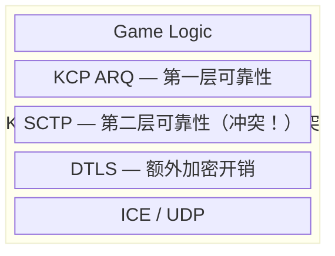

**问题一览**：

| 问题        | 说明                                            |
|-----------|-----------------------------------------------|
| 双重可靠性     | KCP ARQ + SCTP ARQ = 双重重传、双重 ACK，纯浪费带宽        |
| 双重拥塞控制    | KCP 的带宽探测与 SCTP 的 CMT 互相干扰，吞吐量反而下降            |
| 延迟叠加      | SCTP 的保守重传 + KCP 的激进重传 = 延迟不减反增               |
| Header 膨胀 | KCP(24) + SCTP(16) + DTLS(13) = 53 字节，有效载荷率骤降 |
| 浏览器端复杂    | 需要一个 JS/WASM 版本的 KCP 实现，维护成本极高                |

### 5.2 正确的做法

**不是"KCP over WebRTC"，而是"根据场景选择 KCP 或 WebRTC"**：

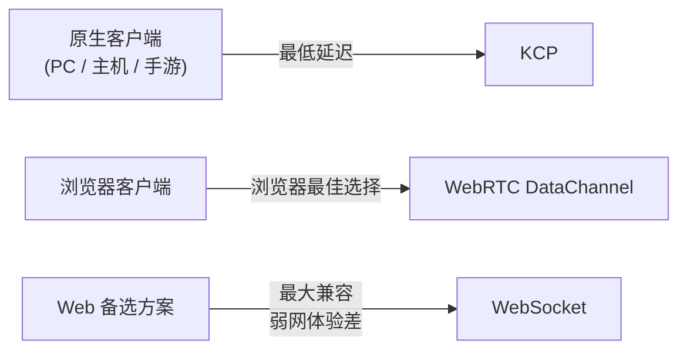

三者共享业务逻辑，传输层按平台选择最优方案。

## 6. WebRTC DataChannel 的不可靠模式详解

WebRTC 的不可靠模式是浏览器端做实时游戏的关键能力。通过配置 `DataChannel` 参数：

```javascript
// 不可靠 + 无序 — 适合位置同步、状态广播
const unreliableDC = pc.createDataChannel('game-unreliable', {
    ordered: false,          // 不保证顺序
    maxRetransmits: 0        // 不重传（完全不可靠）
});

// 不可靠 + 有序 — 适合需要顺序但不关心偶尔丢包的场景
const sequencedDC = pc.createDataChannel('game-sequenced', {
    ordered: true,           // 保证顺序
    maxRetransmits: 0        // 不重传（只投递最新的）
});

// 可靠 + 有序 — 适合命中判定、交易等关键操作
const reliableDC = pc.createDataChannel('game-reliable', {
    ordered: true,           // 保证顺序
    maxRetransmits: null,    // 无限重传（完全可靠）
    // 或使用 maxPacketLifetime 替代
    // maxPacketLifetime: 3000  // 3秒内可靠
});

// 部分可靠 — 有限重传
const partialDC = pc.createDataChannel('game-partial', {
    ordered: false,
    maxRetransmits: 3        // 最多重传3次
});
```

**SCTP 的可靠性模型**：

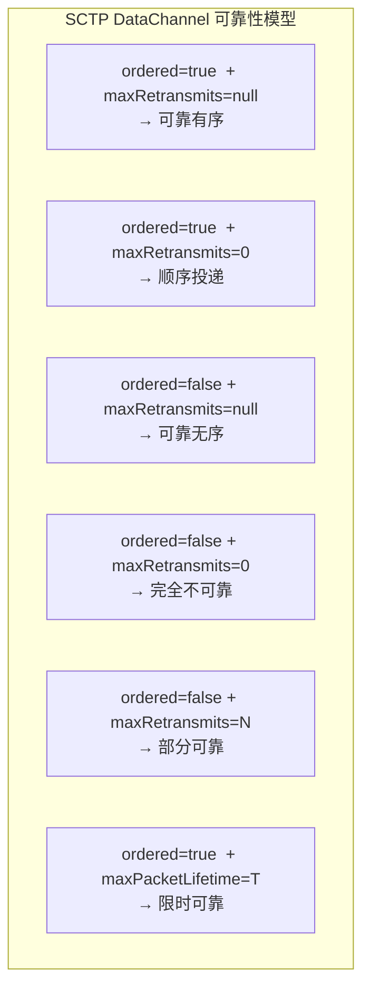

## 7. 弱网对抗策略

### 7.1 KCP 的弱网优化

```go
// 极速模式 — 牺牲带宽换取最低延迟
session.SetNoDelay(1, 10, 2, 1)
// 参数说明：
//   nodelay=1  : 启用无延迟模式
//   interval=10: 内部刷新间隔 10ms
//   resend=2   : 快速重传，2 个 ACK 跨越即重传
//   nc=1       : 关闭拥塞控制，全力发送

// FEC 前向纠错 — 无需重传即可恢复丢包
// 10 个数据片 + 3 个校验片 = 可容忍 3 个包丢失
listener, _ := kcp.ListenWithOptions(":8080", block, 10, 3)

// 发送窗口
session.SetWindowSize(1024, 1024)
```

### 7.2 WebRTC 的弱网对抗

WebRTC 的弱网对抗依赖 SCTP 内部机制，无法像 KCP 那样精细调节。但可以结合应用层策略：

```javascript
// 客户端侧：插值 + 预测
class GameState {
    constructor() {
        this.entities = new Map();
        this.lastUpdate = 0;
    }

    // 收到服务端位置更新
    onEntitySync(data) {
        const entity = this.entities.get(data.playerId);
        if (!entity) return;

        // 客户端插值：平滑过渡到新位置
        entity.targetX = data.x;
        entity.targetY = data.y;
        entity.lastSyncTime = Date.now();
    }

    // 每帧渲染
    update(deltaTime) {
        for (const entity of this.entities.values()) {
            // 线性插值（Lerp）平滑位置
            const lerpFactor = Math.min(1, deltaTime * 10);
            entity.renderX += (entity.targetX - entity.renderX) * lerpFactor;
            entity.renderY += (entity.targetY - entity.renderY) * lerpFactor;
        }
    }
}
```

### 7.3 通用弱网策略

无论使用哪种协议，都应实现以下应用层策略：

| 策略        | 说明            | 适用场景      |
|-----------|---------------|-----------|
| **客户端预测** | 本地先执行，服务端后纠正  | 移动、射击     |
| **服务端回滚** | 收到延迟输入后回滚状态重算 | 竞技 FPS、格斗 |
| **实体插值**  | 平滑过渡其他玩家位置    | 所有实时游戏    |
| **冗余发送**  | 关键数据连续发 2-3 次 | 命中判定      |
| **快照压缩**  | 只发送增量（delta）  | 大量实体同步    |
| **优先级队列** | 关键消息优先投递      | 混合可靠/不可靠  |

## 8. 总结

### 选择决策树

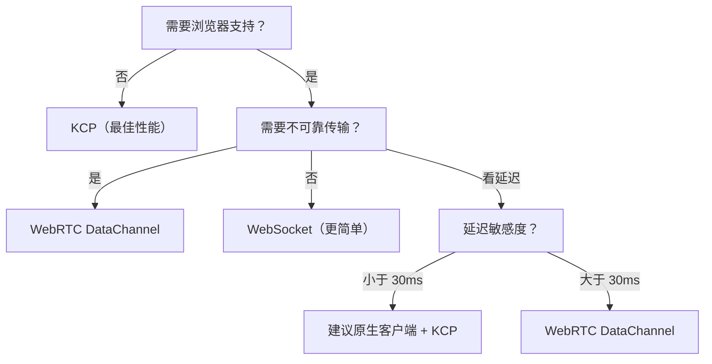

### 一句话总结

> **不是所有游戏都需要 KCP，但所有浏览器实时游戏都需要 WebRTC DataChannel 的不可靠模式。** WebSocket 的 TCP 队头阻塞是实时游戏的致命伤——当你在弱网下看到鱼群瞬移、英雄瞬移、子弹延迟发射，那就是 TCP 队头阻塞在作祟。

---

*本文基于 [kratos-transport](https://github.com/tx7do/kratos-transport) 项目的 KCP、WebRTC、WebSocket 传输模块的实际实现编写。项目地址：https://github.com/tx7do/kratos-transport*
